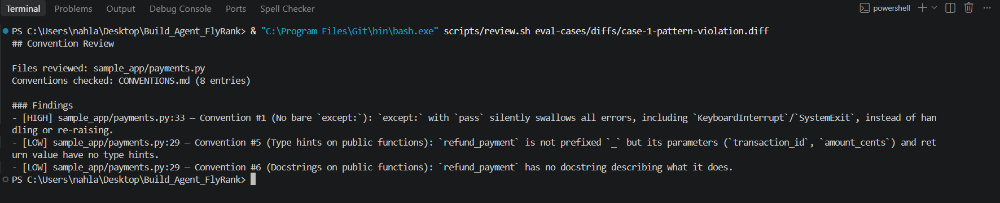
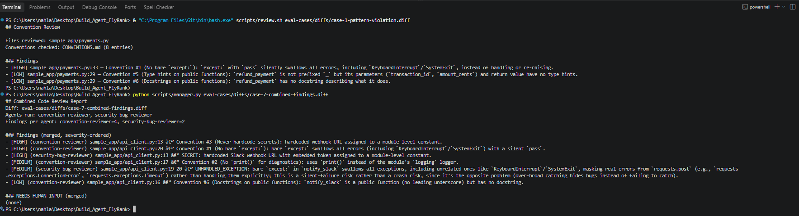
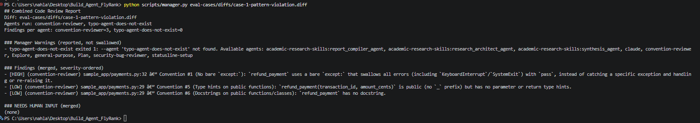

# FL-07 Code Review Agent

FL-07 Code Review Agent, built for FlyRank's General AI Fluency track, based on the FL-06 spec: two read-only review subagents check small Python diffs in `sample_app/` against the 8 entries in `CONVENTIONS.md`, with a deterministic manager that merges their findings into one severity-ordered report.

## Architecture

- `scripts/manager.py` is a thin, **non-LLM** coordinator: it runs both subagents against the same diff and merges their findings by parsing each agent's `- [SEVERITY] ...` bullet lines and sorting HIGH -> MEDIUM -> LOW.
- `.claude/agents/convention-reviewer.md` checks the diff against the numbered entries in `CONVENTIONS.md` (bare `except:`, `print()` vs `logging`, hardcoded secrets, naming, type hints, docstrings, mutable defaults, HTTP timeouts).
- `.claude/agents/security-bug-reviewer.md` checks only two categories: hardcoded secrets/credentials and unhandled-exception/crash-risk paths introduced by the diff.
- Each subagent is restricted to `tools: Read, Grep, Glob` in its own frontmatter, and `scripts/review.sh` additionally passes `--allowedTools "Read,Grep,Glob"` at the CLI layer.
- Why the manager is non-LLM (per `build-log.md`, Milestone 3): an LLM-based summarize-and-merge step could decide a finding looks minor and drop it while paraphrasing, which is exactly the "does one agent's output silently disappear?" risk; a dumb regex-based parse either finds every bullet each sub-agent printed, or finds fewer than expected and says so loudly in a "Manager Warnings" section — it has no way to quietly lose one.

## How to run

Single-agent run (defaults to `convention-reviewer` when no agent name is given):

```bash
bash scripts/review.sh <diff-file> [agent-name]
```

Combined run (both agents plus deterministic merge):

```bash
python scripts/manager.py <diff-file>
```

Reproducing the documented runs (`eval-cases/diffs/` -> `reports/`):

| Diff fixture | Command | Saved report |
|---|---|---|
| `eval-cases/diffs/case-1-pattern-violation.diff` | `bash scripts/review.sh eval-cases/diffs/case-1-pattern-violation.diff` (convention-reviewer) | `reports/case-1-output.txt` |
| `eval-cases/diffs/case-2-correct-pattern.diff` | `bash scripts/review.sh eval-cases/diffs/case-2-correct-pattern.diff` (convention-reviewer) | `reports/case-2-output.txt` |
| `eval-cases/diffs/case-3-hardcoded-secret.diff` | `bash scripts/review.sh eval-cases/diffs/case-3-hardcoded-secret.diff security-bug-reviewer` | `reports/case-3-output.txt` |
| `eval-cases/diffs/case-4-unhandled-exception.diff` | `bash scripts/review.sh eval-cases/diffs/case-4-unhandled-exception.diff security-bug-reviewer` | `reports/case-4-output.txt` |
| `eval-cases/diffs/case-5-clean-diff.diff` | `bash scripts/review.sh eval-cases/diffs/case-5-clean-diff.diff` (convention-reviewer) | `reports/case-5-output.txt` |
| `eval-cases/diffs/case-7-combined-findings.diff` | `python scripts/manager.py eval-cases/diffs/case-7-combined-findings.diff` | `reports/case-7-output.txt` (per-agent raws: `reports/case-7-convention-raw.txt`, `reports/case-7-security-raw.txt`) |
| `eval-cases/diffs/case-8-new-pattern-hitl.diff` | `bash scripts/review.sh eval-cases/diffs/case-8-new-pattern-hitl.diff` (convention-reviewer) | `reports/case-8-output.txt` |
| Partial-failure run (tampered `AGENTS`, see `build-log.md`) | Temporarily set `AGENTS` to `["convention-reviewer", "typo-agent-does-not-exist"]`, then `python scripts/manager.py eval-cases/diffs/case-1-pattern-violation.diff`, then revert | `reports/case-partial-failure-test.txt` |

Note: `CONVENTIONS.md` is never piped into the prompt by the runner scripts; each agent reads it live with its own Read tool on every invocation.

## Guardrails

- Tool restriction: subagent frontmatter (`tools: Read, Grep, Glob`) plus the `--allowedTools "Read,Grep,Glob"` CLI flag deny Edit/Write/Bash, so there is no write/commit/push path even by accident.
- Secret redaction: a secret finding's detail must contain ONLY the file, line number, and finding type — never the secret value itself, not in full, not truncated, not partially masked (not even its prefix).
- Human-in-the-loop trigger: a deliberate-looking new pattern the agent cannot resolve from the current conventions list goes under a `NEEDS HUMAN INPUT` heading as a pause-and-ask, not a silent approve/reject (exercised by `case-8-new-pattern-hitl.diff` / `reports/case-8-output.txt`).
- Failure reporting: a missing diff exits 1 with `ERROR: diff file not found: ...`, an empty diff exits 1 refusing to fabricate a report, and manager failures surface verbatim under `Manager Warnings (reported, not swallowed)` without erasing the working agent's findings.

## Example output

Real content of `reports/case-7-output.txt`, verbatim:

```
## Combined Code Review Report
Diff: eval-cases/diffs/case-7-combined-findings.diff
Agents run: convention-reviewer, security-bug-reviewer
Findings per agent: convention-reviewer=4, security-bug-reviewer=1

### Findings (merged, severity-ordered)
- [HIGH] (convention-reviewer) sample_app/api_client.py:13 — Convention #3 (Never hardcode secrets): hardcoded credential assigned to a module-level constant.
- [HIGH] (convention-reviewer) sample_app/api_client.py:20 — Convention #1 (No bare `except:`): bare `except: pass` in `notify_slack` silently swallows all errors, including `KeyboardInterrupt`/`SystemExit`.
- [HIGH] (security-bug-reviewer) sample_app/api_client.py:13 — SECRET: Hardcoded Slack webhook URL (with embedded workspace/bot/token path segments) assigned to a module-level constant `SLACK_WEBHOOK_URL`, rather than being loaded from an environment variable or secrets manager.
- [MEDIUM] (convention-reviewer) sample_app/api_client.py:17 — Convention #2 (No `print()` for diagnostics): `notify_slack` uses `print()` instead of the module `logger`.
- [LOW] (convention-reviewer) sample_app/api_client.py:16 — Convention #6 (Docstrings on public functions): `notify_slack` is a public function (no leading underscore) but has no docstring.

### NEEDS HUMAN INPUT (merged)
(none)
```

## Deviations from the FL-06 spec

Full detail for each is in `build-log.md`; summaries:

- Implementation substrate choice: Claude Code subagents under `.claude/agents/*.md` invoked headlessly via `claude -p --agent <name>`, because restricting the tool list in frontmatter makes "no write access" enforced by the harness rather than hand-rolled in script code.
- Synthetic fixtures instead of a real A4 branch: no real A4 branch existed in this folder, so `sample_app/`, `CONVENTIONS.md`, and the `eval-cases/diffs/` fixtures were generated here from scratch.
- Non-LLM manager: `scripts/manager.py` merges by deterministic regex parse-and-sort with a loud `Manager Warnings` section, so one agent's output cannot silently disappear the way an LLM summarize-and-merge step could drop it.
- Milestone 4 pgvector deferral: deferred, not attempted — with 8 short conventions entries, reading the whole file every run is faster and more reliable than retrieval, which would add embedding/retrieval failure surface for no accuracy or latency benefit at this size.

## Screenshots


Single-agent run flagging a real violation.


Manager run on case-7 merging both agents' findings.


Partial-failure run showing a Manager Warning without losing the working agent's findings.

## Screen Recording

[Screen recording link to be added]

## Build log

Full timestamped detail: [build-log.md](build-log.md)
